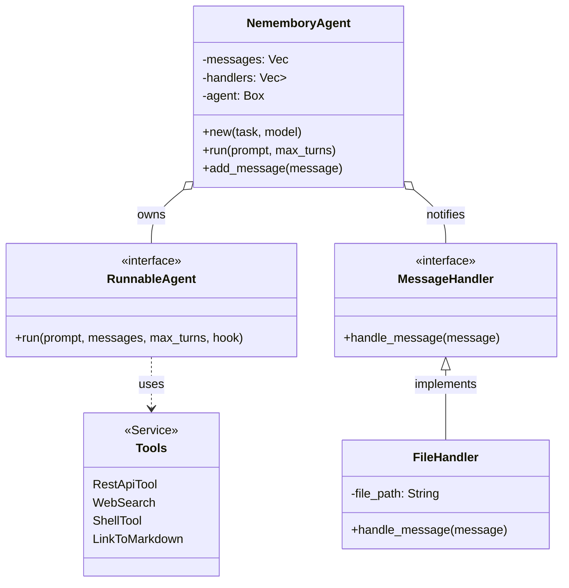

# Nemembory Core

The core library containing the agent logic, tools, and handlers for the Nemembory system.

## NememboryAgent

The `NememboryAgent` is the central struct that orchestrates the interaction between the user, the LLM, and the available tools.



### Responsibilities

- **State Management**: Maintains the conversation history (`messages`).
- **Execution**: Wraps the underlying `rig::agent::Agent` (Anthropic or Gemini) to process prompts.
- **Tool Integration**: Configures the agent with a suite of tools:
  - `RestApiTool`: For making HTTP requests.
  - `WebSearch`: For searching the internet.
  - `ShellTool`: For executing shell commands.
  - `LinkToMarkdown`: For converting web pages to Markdown.
- **Message Handling**: Dispatches new messages (both user inputs and assistant responses) to registered `MessageHandler`s.

### Usage

```rust
let agent = NememboryAgent::new("Your task here".to_string(), ModelProvider::Anthropic)
    .default_handlers(); // Adds file logging

let response = agent.run("User prompt", 4).await?;
```

## Handlers

The system uses a `MessageHandler` trait to decouple side effects (like logging) from the core agent logic. Handlers are executed asynchronously whenever a new message is added to the agent's history.

### `MessageHandler` Trait

```rust
#[async_trait]
pub trait MessageHandler {
    async fn handle_message(&self, message: Message) -> Result<(), std::io::Error>;
}
```

### Available Handlers

#### `FileHandler`

- **Purpose**: Logs all conversation messages to a specified file.
- **Implementation**: Appends the timestamp, role (User/Assistant), and message content to the file.
- **Default**: The `default_handlers()` method adds a `FileHandler` writing to `agent_messages.log`.

## Hooks

The agent also supports execution hooks via `HandleAgentResponse` to intercept and log tool calls or intermediate steps during the LLM's reasoning process.
