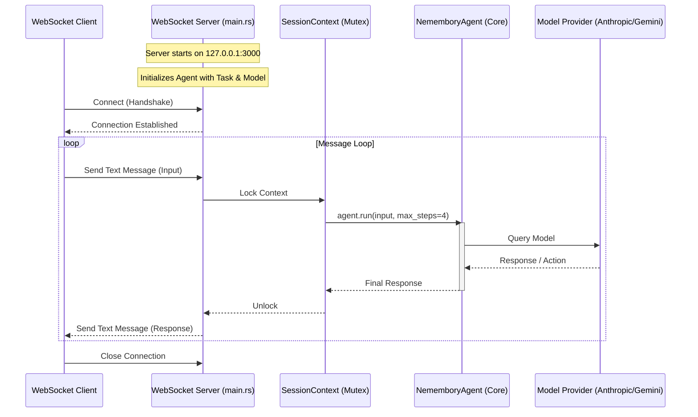

# Nemembory Server

A WebSocket-based server that wraps the `NememboryAgent` core logic.

## Architecture

The server listens for WebSocket connections on `127.0.0.1:3000`. It maintains a shared `SessionContext` containing the agent instance, which processes incoming text messages using a configured LLM provider (Anthropic or Gemini).



## Usage

Run the server by specifying the model provider and the initial task:

```bash
cargo run -- --model <anthropic|gemini> --task "Your task description"
```
